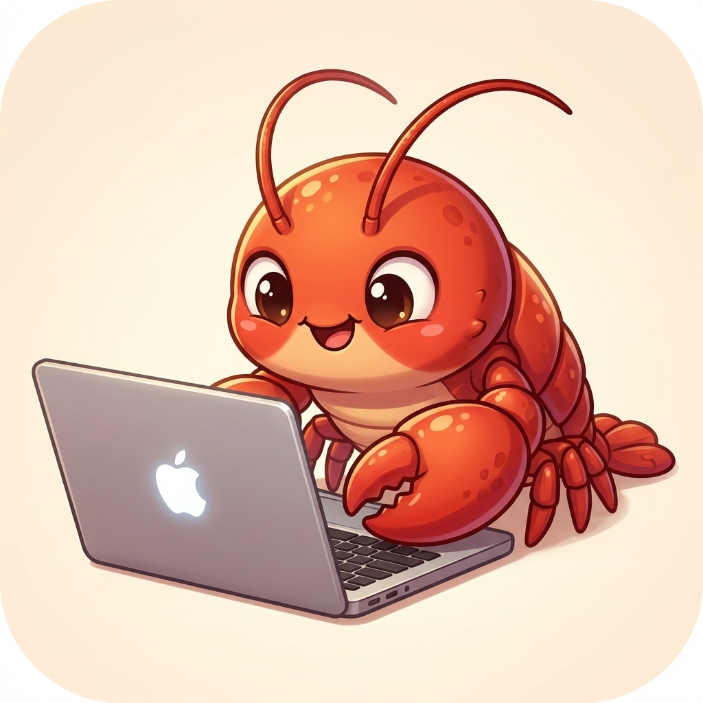
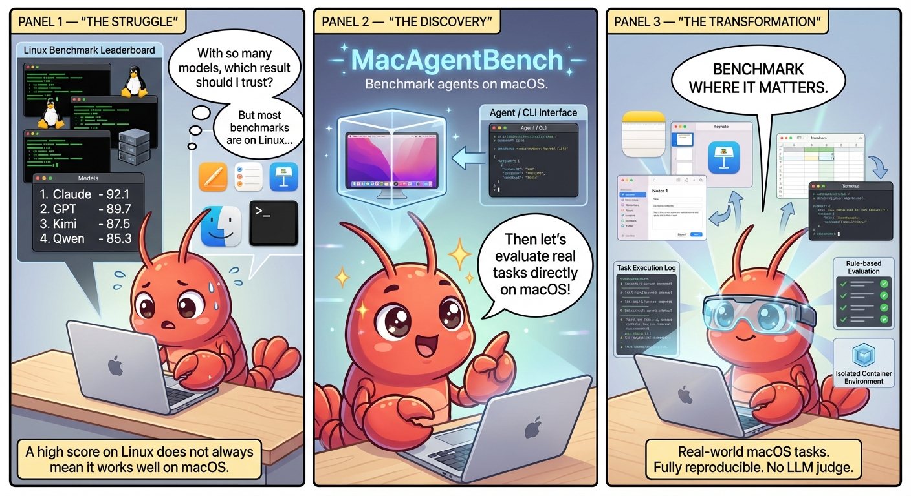

<h1 align="center">&nbsp; MacAgentBench: Benchmark agents where they actually work — on macOS.</h1>

  <strong>A macOS benchmark for evaluating AI agents on real desktop workflows. 
Reproducible tasks, rule-based evaluation, and native app coverage across everyday work scenarios.</strong> 

  
  
  
  
  

  

---
## 🔎TL;DR

1. We provide a fully configured macOS-based OpenClaw environment that runs out-of-the-box on both Linux and Windows via Docker. In addition, we address the complex permission issues in macOS, ensuring that OpenClaw can execute tasks without failing due to permission restrictions. Everyone is welcome to try it out and contribute! 👏
🔗 https://github.com/JiaranI/Mac-in-Docker-OpenClaw

2. We introduce a benchmark designed to evaluate OpenClaw in real-world usage scenarios. 
It covers both the default tasks supported by OpenClaw and tasks commonly encountered in real working environments.

3. Our evaluation relies on manually designed rule-based evaluators, avoiding the uncertainty introduced by using LLMs as judges.
Each task is executed in an independent container, ensuring that tasks do not interfere with each other during evaluation.

1. Running the benchmark is straightforward: only a model ID and API key are required, with no additional configuration needed.

## Quick Start

## 📋Benchmark feature

1. Compared to existing benchmarks for evaluating OpenClaw (e.g., PinchBench and Terminal Bench), our benchmark focuses primarily on real-world user scenarios.
All tasks are executed on macOS rather than Linux, bridging the gap between evaluation environments and actual usage scenarios. This provides a more realistic assessment of OpenClaw’s capabilities in everyday workflows.

2. Our benchmark supports testing all skills provided by OpenClaw by default, ensuring that even newly deployed lobsters 🦞 can be evaluated fairly and comprehensively.

3. The benchmark includes a wide range of macOS-specific scenarios and capabilities, such as productivity workflows using Apple Numbers, Apple Pages, and Apple Keynote, as well as native macOS applications like Notes, Reminders, and other GUI-dependent tasks.
This allows us to evaluate OpenClaw’s capabilities from multiple perspectives across realistic desktop workflows.

<!-- 4. The tasks included in the benchmark are collected from frequent real-world usage scenarios shared by users of OpenClaw across the internet. -->

Our benchmark currently covers **110** tasks across **18** macOS app and tool categories, reflecting real-world OpenClaw usage scenarios. Each task is designed to test specific capabilities, from productivity apps to terminal utilities.

| App             | Task Focus                  | Example Instruction                                                                                                                                                                                                        | # of Tasks |
| :-------------- | :-------------------------- | :------------------------------------------------------------------------------------------------------------------------------------------------------------------------------------------------------------------------- | :--------- |
| Apple Notes     | Note management             | `In Apple Notes, list all existing notes and write all note titles into a file named "test.md" on the Desktop.`                                                                                                            | 8          |
| BlogWatcher     | Subscribe to blogs          | `In BlogWatcher, add a blog named "OpenAI Blog" with URL "https://openai.com/news/rss.xml".`                                                                                                                               | 7          |
| 🦞 ClawHub      | Control OpenClaw SKILLs     | `From ClawHub, install "incident-triage-playbook" at version "1.0.0" into "$HOME/Desktop/clawhub_skills_1_1".`                                                                                                             | 2          |
| GifGrep         | Search & share GIFs         | `Search Tenor for "cat typing on keyboard", then save GIF result URLs to "$HOME/Desktop/gifgrep_urls_1_1.txt", one URL per line.`                                                                                          | 4          |
| GitHub          | Store & share code          | `Check the "openclaw/openclaw" repository and get its full_name, description, license_name, homepage_url, and main_language. Save them to "$HOME/Desktop/gh_repo_info_1_1.txt".`                                           | 5          |
| Himalaya        | Send & receive emails       | `Check the latest OTP email in Inbox (search across all pages) and save only one line to "$HOME/Desktop/mail_otp_1_1.txt" as "otp_code: <6-digit-code>". If no OTP email exists, write "otp_code: none".`                  | 8          |
| Obsidian        | Manage Markdown files       | `In Obsidian, list all notes in the "Projects/Planning" folder and save the note paths to "$HOME/Desktop/obsidian_projects_list_1.txt", one per line.`                                                                     | 8          |
| Peekaboo        | Launch and inspect apps     | `Open "TextEdit" and bring it to the foreground.`                                                                                                                                                                           | 8          |
| Reminders       | Task reminders              | `In the Reminders app, create a new reminder titled "Submit expense report".`                                                                                                                                              | 10         |
| Sherpa-ONNX-TTS | Text to speech              | `In Terminal, use 'node "$HOME/Desktop/sherpa-onnx-tts.cjs"' to turn the sentence "Stand-up starts in ten minutes." into speech and save the WAV file to "$HOME/Desktop/sherpa_tts_1_1.wav".`                              | 2          |
| SongSee         | Audio to spectrogram        | `In Terminal, use SongSee to generate a default spectrogram for "$HOME/Desktop/Ode to Joy.mp3" and save it to "$HOME/Desktop/songsee_spectrogram_1.png".`                                                                  | 9          |
| tmux            | Terminal session management | `In Terminal, check what the tmux session "tmux-shared-read-a1" is doing and save the result as JSON to "$HOME/Desktop/tmux_result_1_1.json".`                                                                             | 6          |
| Video Frames    | Extract frames              | `In Terminal, use ffmpeg to extract the first frame from "$HOME/Desktop/benchmark_source.mp4" and save it to "$HOME/Desktop/vf_first_frame_1.jpg".`                                                                        | 3          |
| Weather         | Check weather               | `Check the weather in "San Francisco" right now. Save the result to "$HOME/Desktop/weather_now_1_1.txt" using this 4-line format: temperature: <value>C, wind: <value>km/h, humidity: <value>%, precipitation: <value>mm.` | 4          |
| Whisper         | Speech to text              | `In Terminal, use Whisper's tiny model to turn "$HOME/Documents/whisper_audio_en_1.ogg" into text and save the transcript to "$HOME/Desktop/whisper_transcript_1_1.txt".`                                                  | 4          |
| Numbers         | Create & manage tables      | `In Numbers, create a new document using 'Blank Black', name it 'test', rename the default sheet and table, and save to 'Document/test.numbers'.`                                                                          | 5          |
| Pages           | Writing & reading           | `In Pages, create a new document 'pages_t1_test_1' and write the content: Passwd: 111111.`                                                                                                                                 | 8          |
| Keynote         | Build slides                | `In Keynote, create a new document using 'Basic Black' template and name it 'keynote_t1_test_1'.`                                                                                                                          | 9          |

## 🗺️RoadMap
#### What we have done
- [x]  Build a fully configured OpenClaw environment

- [x] Add all task supported by default OpenClaw SKILLs

- [x] Add daily work macOS tasks

- [x] Build a leaderboard website

- [x] Test on a few advanced models
  - [x] Claude 4.6 opus
  - [x] GPT5.4
  - [x] Minimax m2.5
  - [x] KIMI 2.5 

#### Upcoming Plans(coming soon...)
- [ ] Add more tasks (calender, clock, finder...)

- [ ] Test on more models
  - [ ] Qwen 3.5
  - [ ] Deepseek 3.2
  - [ ] ...

## 🙌 Contribution Guide
We warmly welcome contributions to improve the OpenClaw Benchmark for macOS! Here’s how you can help:

1️⃣ Add Support for New Models
- Integrate support for new language or agent models.

- Test existing tasks on new models and report results.

- Ensure compatibility with our Docker-based OpenClaw environment.

2️⃣ Add New Tasks
- Submit new macOS tasks that reflect real-world user scenarios.

- Provide clear instructions, expected outputs, and, if possible, configuration screenshots or screen recordings.

- Include tasks across different apps (productivity, terminal utilities, GUI-based apps) to enrich the benchmark coverage.

3️⃣ Verification & Automation
- Write verification scripts for tasks to ensure consistency and correctness.

- Automate detection of inactive platforms or failed task execution.

4️⃣ Translations & Localization
- Translate task instructions or documentation into English, Japanese, Korean, or other languages.

- Help make the benchmark accessible to a broader community.

#### How to Contribute
- Fork the repository.

- Make your changes in a separate branch.

- Submit a Pull Request with a clear description of your contribution.

- If unsure, open an Issue first to discuss your idea—we respond quickly!

💡 Tip: When adding tasks, try to follow the existing format in tasks/ and include example instructions similar to the ones in our benchmark table.

## ❤ Acknowledgments
We would like to thank the following projects and communities for their invaluable contributions, which helped make this benchmark possible:

OpenClaw - https://github.com/openclaw/openclaw

OpenGVLab – https://github.com/OpenGVLab

Docker-OSX – https://github.com/sickcodes/Docker-OSX

## 📬 Contact
If you have questions or would like to collaborate, please contact us at:

- [Yikun Fu](https://github.com/JiaranI), Shanghai AI Laboratory
  📧 fuyikun123456@163.com

- [Bowen Fu](https://github.com/HappyBug7), XJTU
  📧 HappyBug@stu.xjtu.edu.cn

- [Biqing Qi](https://github.com/Biqing-Qi), Shanghai AI Laboratory
  📧 qibiqing@pjlab.org.cn
